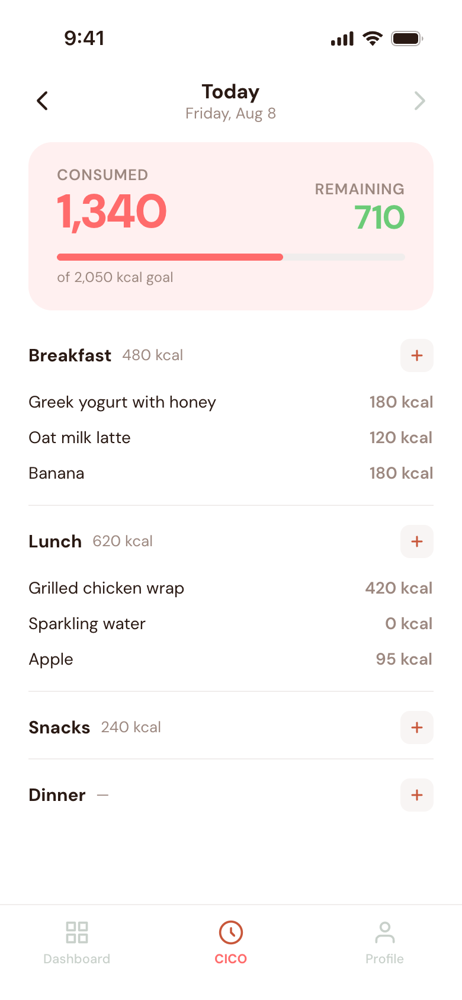

# CICO

**Calories In, Calories Out.** A simple, friction-free calorie tracking app for iOS and Android, stripped down to the essentials, no clutter, just calories.

Built around one idea: no login or account required, works entirely offline, and has no ads. No user information is captured, shared, or sold to anyone.

<p align="center">
  
  
</p>

## Features

- **Daily logging** - log meals under Breakfast, Lunch, Snacks, and Dinner, with calories calculated automatically from portion size
- **Food search & barcode scanning** - search Open Food Facts by name or scan a barcode, results are cached locally for instant future lookups
- **Custom foods** - add your own foods with calories per 100g and a reference portion
- **Weekly dashboard** - visual breakdown of calories consumed per day, with optional weight logging
- **Personalized goals** - a suggested daily calorie target based on your stats (Mifflin-St Jeor BMR + activity level), fully overridable
- **Local-first & offline** - no account required; all logging works fully offline, with graceful fallbacks when search is unavailable

## Tech Stack

| | |
|---|---|
| Framework | [Expo](https://expo.dev) + React Native |
| Navigation | [Expo Router](https://docs.expo.dev/router/introduction/) (file-based, tab navigation) |
| Styling | [NativeWind](https://www.nativewind.dev) (Tailwind CSS for React Native) |
| Database | [expo-sqlite](https://docs.expo.dev/versions/latest/sdk/sqlite/) (local, on-device SQLite) |
| Language | TypeScript |
| Food database | [Open Food Facts API](https://world.openfoodfacts.org) |
| Barcode scanning | expo-camera + expo-barcode-scanner |

All dependencies are MIT licensed and free to use.

## Installation

### Prerequisites

- [Node.js](https://nodejs.org) 18+
- [pnpm](https://pnpm.io/installation)
- [Expo Go](https://expo.dev/go) app on your phone, or an iOS/Android simulator

### Setup

```bash
# Clone the repo
git clone https://github.com/isuser/cico.git
cd cico

# Install dependencies
pnpm install

# Start the development server
pnpm start
```

Then either:
- Scan the QR code with Expo Go (iOS/Android), or
- Press `i` for the iOS simulator, `a` for the Android emulator, or `w` for web

### Other scripts

```bash
pnpm ios      # open directly in the iOS simulator
pnpm android  # open directly in the Android emulator
pnpm web      # run in the browser
pnpm lint     # lint the project
```

## License

This project is licensed under the MIT License, see [LICENSE](LICENSE) for details.
